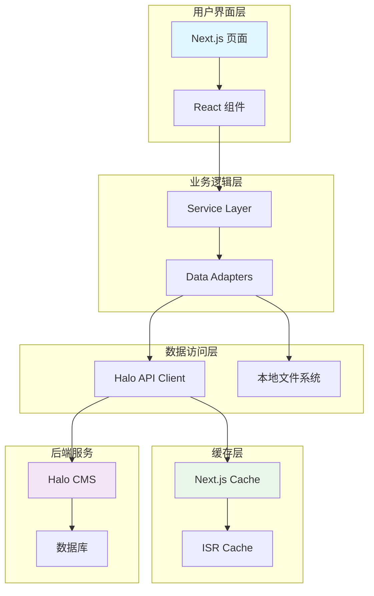

# Magic Portfolio + Halo API 前端开发文档

## 📚 文档导航

本目录包含了 Magic Portfolio 项目使用 Halo API 作为后端服务的完整开发文档套件。项目专注于前端展示，Halo CMS 负责内容管理。请根据你的角色和需求选择相应的文档。

### 🎯 快速导航

| 角色 | 推荐阅读顺序 | 文档链接 |
|------|-------------|----------|
| **项目经理** | 1 → 4 → 3 | [开发计划](./halo-integration-plan.md) → [检查清单](./halo-migration-checklist.md) → [实施指南](./halo-implementation-guide.md) |
| **架构师** | 1 → 2 → 5 | [开发计划](./halo-integration-plan.md) → [技术规范](./halo-technical-specification.md) → [配置模板](./halo-config-templates.md) |
| **前端开发者** | 3 → 2 → 5 | [实施指南](./halo-implementation-guide.md) → [技术规范](./halo-technical-specification.md) → [配置模板](./halo-config-templates.md) |
| **运维工程师** | 5 → 4 → 3 | [配置模板](./halo-config-templates.md) → [检查清单](./halo-migration-checklist.md) → [实施指南](./halo-implementation-guide.md) |

## 📖 文档详细说明

### 1. [Magic Portfolio 集成 Halo API 开发计划](./halo-integration-plan.md)
**目标读者**: 项目经理、技术负责人
**内容概览**:
- 项目概述和开发背景
- 当前架构分析和 Halo API 架构分析
- 开发策略和时间线规划
- 风险评估和性能目标
- 前端专用架构设计

**关键信息**:
- 🕐 **预计耗时**: 4 周
- 🎯 **性能目标**: 首屏 < 2秒，API < 500ms
- 📊 **成功指标**: 99.9% 可用性，90% 缓存命中率

### 2. [Magic Portfolio + Halo API 技术规范](./halo-technical-specification.md)
**目标读者**: 架构师、高级开发者  
**内容概览**:
- 详细的系统架构设计图
- API 客户端实现方案
- 数据适配器和类型系统
- 缓存策略和性能优化
- 错误处理和监控方案

**技术亮点**:
- 🏗️ **分层架构**: 服务层 → 适配器层 → 组件层
- 🔄 **数据流**: Halo CMS → API Client → Service → Adapter → React
- 📈 **监控**: 性能指标、错误追踪、健康检查

### 3. [Magic Portfolio + Halo API 前端开发指南](./halo-implementation-guide.md)
**目标读者**: 前端开发者、全栈开发者
**内容概览**:
- 分步开发说明和代码示例
- 前端集成最佳实践
- 故障排除和调试技巧
- 部署和维护指南

**实用工具**:
- 🔗 **连接测试脚本**: 验证 Halo API 连通性
- 🎨 **组件开发示例**: React 组件与 Halo API 集成
- 🧪 **测试套件**: 单元测试和集成测试示例
- 📊 **监控仪表板**: 系统健康状态监控

### 4. [Magic Portfolio + Halo 开发检查清单](./halo-migration-checklist.md)
**目标读者**: 所有团队成员
**内容概览**:
- 完整的开发检查清单
- 分阶段验证要点
- 故障处理流程
- 成功验收标准

**检查项目**:
- 📋 **开发前**: 环境准备、Halo配置、依赖安装
- 🔧 **开发阶段**: 基础设施、服务层、前端组件
- 🧪 **测试验证**: 单元测试、集成测试、性能测试
- 🚀 **部署上线**: 环境配置、安全检查、功能验证

### 5. [Magic Portfolio + Halo API 前端配置模板](./halo-config-templates.md)
**目标读者**: 开发者、运维工程师
**内容概览**:
- 前端项目环境变量配置
- Docker 和 Kubernetes 配置
- CI/CD 流水线配置
- 开发环境验证脚本

**配置模板**:
- 🌍 **环境配置**: 开发/生产环境变量模板
- 🐳 **容器化**: Docker 和 Docker Compose 配置
- ☸️ **Kubernetes**: 完整的 K8s 部署配置
- 🔄 **CI/CD**: GitHub Actions 自动化流水线

## 🚀 快速开始

### 第一次开发？按这个顺序阅读：

1. **了解方案** → [开发计划](./halo-integration-plan.md) (15分钟)
2. **掌握技术** → [技术规范](./halo-technical-specification.md) (30分钟)
3. **开始开发** → [实施指南](./halo-implementation-guide.md) (45分钟)
4. **跟踪进度** → [检查清单](./halo-migration-checklist.md) (持续使用)
5. **配置环境** → [配置模板](./halo-config-templates.md) (参考使用)

### 紧急情况？
- 🚨 **服务异常** → [实施指南 - 故障排除](./halo-implementation-guide.md#故障排除指南)
- ⚡ **快速回滚** → [检查清单 - 回滚计划](./halo-migration-checklist.md#-回滚计划-rollback-plan)
- 🔧 **配置问题** → [配置模板](./halo-config-templates.md)

## 🏗️ 架构概览

## 📊 项目收益

### 🎯 直接收益
- **内容管理效率提升 50%**: 可视化编辑器，实时预览
- **SEO 优化能力增强**: 动态元数据，结构化数据  
- **扩展性大幅提升**: 插件系统，主题定制
- **团队协作改善**: 多用户管理，权限控制

### 📈 长期价值
- **专业内容管理**: 现代化 CMS 功能
- **开发效率提升**: 专注前端开发
- **用户体验优化**: 更快的内容加载
- **扩展性增强**: 基于 Halo 插件生态

## ⚠️ 重要注意事项

### 🔒 安全考虑
- **API 令牌管理**: 定期轮换，安全存储
- **网络安全**: HTTPS 强制，CORS 配置
- **权限控制**: 最小权限原则
- **数据加密**: 敏感信息保护

### 📋 兼容性要求
- **Halo 版本**: 2.17+ (推荐 2.21+)
- **Node.js 版本**: 18+ (推荐 20+)  
- **浏览器支持**: 现代浏览器 (ES2017+)
- **数据库**: H2/PostgreSQL/MySQL

### 🔄 迁移风险
- **数据丢失风险**: 低 (有完整备份策略)
- **服务中断风险**: 极低 (降级机制保证)
- **性能影响风险**: 低 (缓存策略缓解)
- **兼容性风险**: 极低 (适配器层保证)

## 📞 支持与帮助

### 🆘 获取帮助
1. **查阅文档**: 首先查看相关文档章节
2. **检查日志**: 查看应用和 Halo 服务日志  
3. **社区支持**: Halo 官方社区和 GitHub Issues
4. **专业支持**: 联系技术团队或 Halo 官方支持

### 🔗 有用链接
- **Halo 官网**: https://halo.run
- **Halo 文档**: https://docs.halo.run  
- **API 文档**: https://api.halo.run
- **GitHub 仓库**: https://github.com/halo-dev/halo
- **社区论坛**: https://bbs.halo.run

### 📧 联系方式
- **技术支持**: [技术团队邮箱]
- **项目反馈**: [项目 Issues 页面]
- **文档问题**: [文档维护团队]

## 🎉 结语

Magic Portfolio 作为 Halo API 的前端展示层，将为用户提供优雅的内容浏览体验。通过遵循这套完整的文档指南，你将能够：

- ✅ **高效开发**现代化前端界面
- ✅ **保持高性能**和优秀用户体验
- ✅ **充分利用**Halo 强大的 CMS 功能
- ✅ **构建可扩展**的前端架构

**祝你开发顺利！** 🚀

---

*最后更新: 2024年01月*  
*文档版本: v1.0.0*  
*维护团队: Magic Portfolio 开发团队*