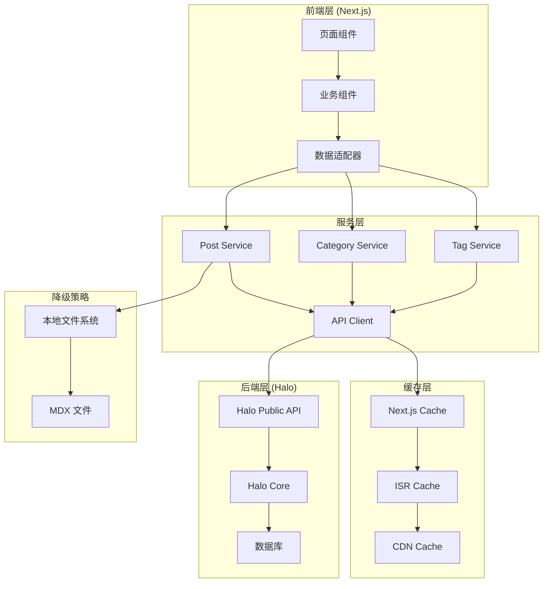

# Magic Portfolio + Halo API 技术规范

## 架构设计图



## 详细技术实现

### 1. 项目结构重组

```
src/
├── lib/
│   ├── halo-client.ts          # Halo API 客户端配置
│   ├── cache.ts                # 缓存管理
│   └── adapters/               # 数据适配器
│       ├── post-adapter.ts     # 文章数据映射
│       ├── category-adapter.ts # 分类数据映射
│       └── tag-adapter.ts      # 标签数据映射
├── services/
│   ├── post-service.ts         # 文章服务
│   ├── category-service.ts     # 分类服务
│   ├── tag-service.ts          # 标签服务
│   └── fallback-service.ts     # 降级服务
├── types/
│   ├── halo.ts                 # Halo API 类型定义
│   └── local.ts                # 本地数据类型
└── hooks/
    ├── use-posts.ts            # 文章数据 Hook
    └── use-categories.ts       # 分类数据 Hook
```

### 2. API 客户端详细配置

```typescript
// src/lib/halo-client.ts
import axios, { AxiosError, AxiosResponse } from 'axios';
import { 
  createPublicApiClient, 
  createConsoleApiClient,
  PublicApiClient,
  ConsoleApiClient
} from '@halo-dev/api-client';

interface HaloClientConfig {
  baseURL: string;
  timeout: number;
  retryCount: number;
  retryDelay: number;
}

class HaloApiClient {
  private config: HaloClientConfig;
  private axiosInstance;
  public publicApi: PublicApiClient;
  public consoleApi: ConsoleApiClient;

  constructor(config: HaloClientConfig) {
    this.config = config;
    this.setupAxiosInstance();
    this.setupApiClients();
  }

  private setupAxiosInstance() {
    this.axiosInstance = axios.create({
      baseURL: this.config.baseURL,
      timeout: this.config.timeout,
      headers: {
        'Content-Type': 'application/json',
        'Authorization': `Bearer ${process.env.HALO_API_TOKEN}`,
      },
    });

    // 请求拦截器
    this.axiosInstance.interceptors.request.use(
      (config) => {
        console.log(`🚀 API Request: ${config.method?.toUpperCase()} ${config.url}`);
        return config;
      },
      (error) => Promise.reject(error)
    );

    // 响应拦截器
    this.axiosInstance.interceptors.response.use(
      (response: AxiosResponse) => {
        console.log(`✅ API Success: ${response.config.url} (${response.status})`);
        return response;
      },
      async (error: AxiosError) => {
        console.error(`❌ API Error: ${error.config?.url}`, error.response?.data);
        
        // 实现重试机制
        if (error.response?.status === 429 || error.response?.status >= 500) {
          return this.retryRequest(error);
        }
        
        return Promise.reject(error);
      }
    );
  }

  private async retryRequest(error: AxiosError, retryCount = 0): Promise<any> {
    if (retryCount >= this.config.retryCount) {
      return Promise.reject(error);
    }

    await this.delay(this.config.retryDelay * Math.pow(2, retryCount));
    
    try {
      return await this.axiosInstance.request(error.config!);
    } catch (retryError) {
      return this.retryRequest(error, retryCount + 1);
    }
  }

  private delay(ms: number): Promise<void> {
    return new Promise(resolve => setTimeout(resolve, ms));
  }

  private setupApiClients() {
    this.publicApi = createPublicApiClient(this.axiosInstance);
    this.consoleApi = createConsoleApiClient(this.axiosInstance);
  }
}

// 单例实例
export const haloClient = new HaloApiClient({
  baseURL: process.env.HALO_API_BASE_URL || 'http://localhost:8090',
  timeout: 10000,
  retryCount: 3,
  retryDelay: 1000,
});
```

### 3. 完整的数据适配器系统

```typescript
// src/lib/adapters/post-adapter.ts
import { HaloPost, LocalPost } from '@/types';

export class PostAdapter {
  static haloToLocal(haloPost: HaloPost): LocalPost {
    return {
      slug: haloPost.spec.slug,
      metadata: {
        title: haloPost.spec.title,
        publishedAt: haloPost.spec.publishTime || haloPost.metadata.creationTimestamp,
        summary: haloPost.status.excerpt || haloPost.spec.excerpt.raw || '',
        image: haloPost.spec.cover,
        images: this.extractImagesFromContent(haloPost.content?.content),
        tag: haloPost.spec.tags?.[0],
        team: [], // 需要从 contributors 映射
        link: haloPost.status.permalink,
      },
      content: haloPost.content?.content || '',
      rawContent: haloPost.content?.raw || '',
      stats: {
        visits: haloPost.stats.visit,
        comments: haloPost.stats.comment,
        upvotes: haloPost.stats.upvote,
      },
      categories: haloPost.categories?.map(cat => ({
        name: cat.metadata.name,
        displayName: cat.spec.displayName,
        slug: cat.spec.slug,
        permalink: cat.status.permalink,
      })) || [],
      tags: haloPost.tags?.map(tag => ({
        name: tag.metadata.name,
        displayName: tag.spec.displayName,
        slug: tag.spec.slug,
        color: tag.spec.color,
        permalink: tag.status.permalink,
      })) || [],
    };
  }

  static localToHalo(localPost: LocalPost): Partial<HaloPost> {
    return {
      spec: {
        title: localPost.metadata.title,
        slug: localPost.slug,
        cover: localPost.metadata.image,
        publishTime: localPost.metadata.publishedAt,
        excerpt: {
          autoGenerate: !localPost.metadata.summary,
          raw: localPost.metadata.summary,
        },
        tags: localPost.metadata.tag ? [localPost.metadata.tag] : [],
        categories: [],
        visible: "PUBLIC",
        allowComment: true,
        pinned: false,
        priority: 0,
        publish: true,
      },
    };
  }

  private static extractImagesFromContent(content?: string): string[] {
    if (!content) return [];
    
    const imageRegex = /]+src="([^">]+)"/g;
    const images: string[] = [];
    let match;
    
    while ((match = imageRegex.exec(content)) !== null) {
      images.push(match[1]);
    }
    
    return images;
  }
}
```

### 4. 服务层详细实现

```typescript
// src/services/post-service.ts
import { haloClient } from '@/lib/halo-client';
import { PostAdapter } from '@/lib/adapters/post-adapter';
import { ApiErrorHandler } from '@/lib/error-handler';

export interface GetPostsOptions {
  page?: number;
  size?: number;
  categoryName?: string;
  tagName?: string;
  sort?: string[];
  keyword?: string;
}

export class PostService {
  async getPosts(options: GetPostsOptions = {}): Promise<LocalPost[]> {
    return ApiErrorHandler.withFallback(
      async () => {
        const response = await haloClient.publicApi.content.post.queryPosts({
          page: options.page || 0,
          size: options.size || 20,
          sort: options.sort || ['spec.publishTime,desc'],
        });

        // 批量获取文章内容
        const postsWithContent = await Promise.all(
          response.data.items.map(async (post) => {
            try {
              const contentResponse = await haloClient.publicApi.content.post
                .queryPostByName(post.metadata.name);
              return { ...post, content: contentResponse.data.content };
            } catch (error) {
              console.warn(`Failed to fetch content for post ${post.metadata.name}:`, error);
              return post;
            }
          })
        );

        return postsWithContent.map(PostAdapter.haloToLocal);
      },
      [] // 空数组作为降级值
    );
  }

  async getPostBySlug(slug: string): Promise<LocalPost | null> {
    return ApiErrorHandler.withFallback(
      async () => {
        // 由于 Halo API 不直接支持按 slug 查询，需要先获取列表再过滤
        const posts = await this.getPosts({ size: 1000 });
        return posts.find(post => post.slug === slug) || null;
      },
      null
    );
  }

  async getPostsByCategory(categorySlug: string, options: GetPostsOptions = {}): Promise<LocalPost[]> {
    return ApiErrorHandler.withFallback(
      async () => {
        const response = await haloClient.publicApi.content.category
          .queryPostsByCategoryName(categorySlug, {
            page: options.page || 0,
            size: options.size || 20,
            sort: options.sort || ['spec.publishTime,desc'],
          });

        return response.data.items.map(PostAdapter.haloToLocal);
      },
      []
    );
  }

  async getPostsByTag(tagSlug: string, options: GetPostsOptions = {}): Promise<LocalPost[]> {
    return ApiErrorHandler.withFallback(
      async () => {
        const response = await haloClient.publicApi.content.tag
          .queryPostsByTagName(tagSlug, {
            page: options.page || 0,
            size: options.size || 20,
            sort: options.sort || ['spec.publishTime,desc'],
          });

        return response.data.items.map(PostAdapter.haloToLocal);
      },
      []
    );
  }
}
```

### 5. React Hooks 集成

```typescript
// src/hooks/use-posts.ts
import { useState, useEffect } from 'react';
import { PostService, GetPostsOptions } from '@/services/post-service';

export function usePosts(options: GetPostsOptions = {}) {
  const [posts, setPosts] = useState<LocalPost[]>([]);
  const [loading, setLoading] = useState(true);
  const [error, setError] = useState<Error | null>(null);

  useEffect(() => {
    let isMounted = true;

    const fetchPosts = async () => {
      try {
        setLoading(true);
        setError(null);
        
        const postService = new PostService();
        const fetchedPosts = await postService.getPosts(options);
        
        if (isMounted) {
          setPosts(fetchedPosts);
        }
      } catch (err) {
        if (isMounted) {
          setError(err instanceof Error ? err : new Error('Unknown error'));
        }
      } finally {
        if (isMounted) {
          setLoading(false);
        }
      }
    };

    fetchPosts();

    return () => {
      isMounted = false;
    };
  }, [JSON.stringify(options)]);

  return { posts, loading, error, refetch: () => fetchPosts() };
}
```

### 6. Next.js API 路由实现

```typescript
// src/app/api/posts/route.ts
import { NextRequest, NextResponse } from 'next/server';
import { PostService } from '@/services/post-service';

export async function GET(request: NextRequest) {
  const searchParams = request.nextUrl.searchParams;
  
  const options = {
    page: Number(searchParams.get('page')) || 0,
    size: Number(searchParams.get('size')) || 20,
    categoryName: searchParams.get('category') || undefined,
    tagName: searchParams.get('tag') || undefined,
    keyword: searchParams.get('keyword') || undefined,
  };

  try {
    const postService = new PostService();
    const posts = await postService.getPosts(options);

    return NextResponse.json({
      success: true,
      data: posts,
      pagination: {
        page: options.page,
        size: options.size,
        total: posts.length,
      },
    });
  } catch (error) {
    console.error('API Error:', error);
    
    return NextResponse.json(
      {
        success: false,
        error: 'Failed to fetch posts',
        message: error instanceof Error ? error.message : 'Unknown error',
      },
      { status: 500 }
    );
  }
}
```

### 7. 环境配置管理

```typescript
// src/config/halo.ts
interface HaloConfig {
  apiBaseUrl: string;
  apiToken: string;
  enableFallback: boolean;
  cacheTimeout: number;
  retryConfig: {
    count: number;
    delay: number;
  };
}

export const haloConfig: HaloConfig = {
  apiBaseUrl: process.env.HALO_API_BASE_URL || 'http://localhost:8090',
  apiToken: process.env.HALO_API_TOKEN || '',
  enableFallback: process.env.HALO_ENABLE_FALLBACK === 'true',
  cacheTimeout: Number(process.env.HALO_CACHE_TIMEOUT) || 300,
  retryConfig: {
    count: Number(process.env.HALO_RETRY_COUNT) || 3,
    delay: Number(process.env.HALO_RETRY_DELAY) || 1000,
  },
};

// 环境变量验证
export function validateHaloConfig(): boolean {
  const required = ['HALO_API_BASE_URL', 'HALO_API_TOKEN'];
  const missing = required.filter(key => !process.env[key]);
  
  if (missing.length > 0) {
    console.error(`Missing required environment variables: ${missing.join(', ')}`);
    return false;
  }
  
  return true;
}
```

### 8. 缓存策略实现

```typescript
// src/lib/cache.ts
import { unstable_cache } from 'next/cache';
import { PostService, GetPostsOptions } from '@/services/post-service';

// 文章列表缓存
export const getCachedPosts = unstable_cache(
  async (options: GetPostsOptions = {}) => {
    const postService = new PostService();
    return await postService.getPosts(options);
  },
  ['halo-posts'],
  {
    revalidate: 300, // 5分钟
    tags: ['posts'],
  }
);

// 单个文章缓存
export const getCachedPost = unstable_cache(
  async (slug: string) => {
    const postService = new PostService();
    return await postService.getPostBySlug(slug);
  },
  ['halo-post'],
  {
    revalidate: 600, // 10分钟
    tags: ['post'],
  }
);

// 分类缓存
export const getCachedCategories = unstable_cache(
  async () => {
    const categoryService = new CategoryService();
    return await categoryService.getCategories();
  },
  ['halo-categories'],
  {
    revalidate: 1800, // 30分钟
    tags: ['categories'],
  }
);

// 手动缓存失效
export async function revalidateCache(tag: string) {
  const { revalidateTag } = await import('next/cache');
  revalidateTag(tag);
}
```

### 9. 错误处理和监控

```typescript
// src/lib/error-handler.ts
export enum ErrorType {
  NETWORK_ERROR = 'NETWORK_ERROR',
  API_ERROR = 'API_ERROR',
  VALIDATION_ERROR = 'VALIDATION_ERROR',
  UNKNOWN_ERROR = 'UNKNOWN_ERROR',
}

export interface ApiError {
  type: ErrorType;
  message: string;
  code?: string;
  details?: any;
  timestamp: Date;
}

export class ApiErrorHandler {
  static async withFallback<T>(
    apiCall: () => Promise<T>,
    fallback: T,
    errorCallback?: (error: ApiError) => void
  ): Promise<T> {
    try {
      return await apiCall();
    } catch (error) {
      const apiError = this.normalizeError(error);
      
      // 记录错误
      this.logError(apiError);
      
      // 调用错误回调
      if (errorCallback) {
        errorCallback(apiError);
      }
      
      // 返回降级值
      return fallback;
    }
  }

  private static normalizeError(error: any): ApiError {
    if (error.response) {
      // HTTP 错误
      return {
        type: ErrorType.API_ERROR,
        message: error.response.data?.message || error.message,
        code: error.response.status.toString(),
        details: error.response.data,
        timestamp: new Date(),
      };
    } else if (error.request) {
      // 网络错误
      return {
        type: ErrorType.NETWORK_ERROR,
        message: 'Network connection failed',
        details: error.request,
        timestamp: new Date(),
      };
    } else {
      // 其他错误
      return {
        type: ErrorType.UNKNOWN_ERROR,
        message: error.message || 'Unknown error occurred',
        timestamp: new Date(),
      };
    }
  }

  private static logError(error: ApiError) {
    console.error(`[${error.type}] ${error.message}`, {
      code: error.code,
      details: error.details,
      timestamp: error.timestamp,
    });
    
    // 生产环境中可以发送到监控服务
    if (process.env.NODE_ENV === 'production') {
      // 例如：发送到 Sentry, LogRocket 等
    }
  }
}
```

### 10. 类型定义系统

```typescript
// src/types/halo.ts
export interface HaloListResult<T> {
  first: boolean;
  hasNext: boolean;
  hasPrevious: boolean;
  items: T[];
  last: boolean;
  page: number;
  size: number;
  total: number;
  totalPages: number;
}

export interface HaloMetadata {
  name: string;
  labels?: Record<string, string>;
  annotations?: Record<string, string>;
  creationTimestamp: string;
  version?: number;
}

export interface HaloPostSpec {
  title: string;
  slug: string;
  cover?: string;
  publishTime?: string;
  excerpt: {
    autoGenerate: boolean;
    raw?: string;
  };
  categories: string[];
  tags: string[];
  visible: "PUBLIC" | "INTERNAL" | "PRIVATE";
  allowComment: boolean;
  pinned: boolean;
  priority: number;
  template?: string;
  owner: string;
  deleted: boolean;
  publish: boolean;
}

export interface HaloPostStatus {
  permalink: string;
  excerpt: string;
  lastModifyTime: string;
  commentsCount: number;
  contributors: string[];
  inProgress: boolean;
  observedVersion?: number;
  phase?: string;
}

export interface HaloPost {
  metadata: HaloMetadata;
  spec: HaloPostSpec;
  status: HaloPostStatus;
  stats: {
    visit: number;
    upvote: number;
    comment: number;
  };
  content?: {
    content: string;
    raw: string;
  };
  categories?: HaloCategory[];
  tags?: HaloTag[];
  contributors?: HaloContributor[];
  owner?: HaloContributor;
}
```

### 11. 性能优化策略

```typescript
// src/lib/performance.ts
export class PerformanceOptimizer {
  // 批量请求优化
  static async batchFetch<T>(
    items: string[],
    fetcher: (name: string) => Promise<T>,
    batchSize = 5
  ): Promise<T[]> {
    const results: T[] = [];
    
    for (let i = 0; i < items.length; i += batchSize) {
      const batch = items.slice(i, i + batchSize);
      const batchResults = await Promise.allSettled(
        batch.map(fetcher)
      );
      
      batchResults.forEach(result => {
        if (result.status === 'fulfilled') {
          results.push(result.value);
        }
      });
    }
    
    return results;
  }

  // 内存缓存
  private static memoryCache = new Map<string, { data: any; expiry: number }>();
  
  static get<T>(key: string): T | null {
    const cached = this.memoryCache.get(key);
    if (cached && cached.expiry > Date.now()) {
      return cached.data;
    }
    return null;
  }
  
  static set<T>(key: string, data: T, ttl = 300000): void { // 5分钟默认TTL
    this.memoryCache.set(key, {
      data,
      expiry: Date.now() + ttl,
    });
  }
}
```

### 12. 测试策略

```typescript
// __tests__/services/post-service.test.ts
import { PostService } from '@/services/post-service';
import { haloClient } from '@/lib/halo-client';

// Mock Halo client
jest.mock('@/lib/halo-client');

describe('PostService', () => {
  let postService: PostService;
  
  beforeEach(() => {
    postService = new PostService();
    jest.clearAllMocks();
  });

  describe('getPosts', () => {
    it('should fetch and transform posts correctly', async () => {
      const mockHaloPosts = [
        {
          metadata: { name: 'test-post', creationTimestamp: '2023-01-01T00:00:00Z' },
          spec: {
            title: 'Test Post',
            slug: 'test-post',
            excerpt: { autoGenerate: true },
            categories: [],
            tags: [],
            visible: 'PUBLIC',
            allowComment: true,
            pinned: false,
            priority: 0,
            owner: 'admin',
            deleted: false,
            publish: true,
          },
          status: {
            permalink: '/posts/test-post',
            excerpt: 'Test excerpt',
            lastModifyTime: '2023-01-01T00:00:00Z',
            commentsCount: 0,
            contributors: [],
            inProgress: false,
          },
          stats: { visit: 10, upvote: 2, comment: 0 },
        },
      ];

      (haloClient.publicApi.content.post.queryPosts as jest.Mock)
        .mockResolvedValueOnce({ data: { items: mockHaloPosts } });

      const result = await postService.getPosts();
      
      expect(result).toHaveLength(1);
      expect(result[0].metadata.title).toBe('Test Post');
      expect(result[0].slug).toBe('test-post');
    });

    it('should handle API errors gracefully', async () => {
      (haloClient.publicApi.content.post.queryPosts as jest.Mock)
        .mockRejectedValueOnce(new Error('API Error'));

      const result = await postService.getPosts();
      
      expect(result).toEqual([]);
    });
  });
});
```

## 部署配置

### Docker 配置
```dockerfile
# Dockerfile
FROM node:18-alpine AS base
WORKDIR /app

COPY package.json pnpm-lock.yaml ./
RUN npm install -g pnpm && pnpm install --frozen-lockfile

COPY . .

# 环境变量
ENV HALO_API_BASE_URL=http://halo:8090
ENV HALO_ENABLE_FALLBACK=true
ENV HALO_CACHE_TIMEOUT=300

RUN pnpm build

EXPOSE 3000
CMD ["pnpm", "start"]
```

### 环境变量清单
```bash
# .env.production
HALO_API_BASE_URL=https://your-halo-instance.com
HALO_API_TOKEN=pat_your_production_token
HALO_ENABLE_FALLBACK=false
HALO_CACHE_TIMEOUT=600
HALO_RETRY_COUNT=3
HALO_RETRY_DELAY=1000
```

## 监控和日志

### 性能监控
```typescript
// src/lib/monitoring.ts
export class PerformanceMonitor {
  static async measureApiCall<T>(
    name: string,
    apiCall: () => Promise<T>
  ): Promise<T> {
    const start = performance.now();
    
    try {
      const result = await apiCall();
      const duration = performance.now() - start;
      
      console.log(`📊 API Call [${name}]: ${duration.toFixed(2)}ms`);
      
      // 发送到监控服务
      this.reportMetric(name, duration, 'success');
      
      return result;
    } catch (error) {
      const duration = performance.now() - start;
      
      console.error(`📊 API Call [${name}] Failed: ${duration.toFixed(2)}ms`, error);
      
      // 发送错误指标
      this.reportMetric(name, duration, 'error');
      
      throw error;
    }
  }

  private static reportMetric(name: string, duration: number, status: string) {
    // 集成 Analytics 或监控服务
    if (typeof window !== 'undefined' && window.gtag) {
      window.gtag('event', 'api_call', {
        event_category: 'performance',
        event_label: name,
        value: Math.round(duration),
        custom_parameter_1: status,
      });
    }
  }
}
```

## 迁移检查清单

### 开发环境验证
- [ ] Halo 服务器运行正常
- [ ] API 令牌配置正确
- [ ] 网络连接畅通
- [ ] 依赖包安装完成

### 功能验证
- [ ] 文章列表显示正常
- [ ] 文章详情页渲染正确
- [ ] 分类和标签功能正常
- [ ] 搜索功能正常
- [ ] 评论系统集成

### 性能验证
- [ ] 首屏加载时间 < 2秒
- [ ] API 响应时间 < 500ms
- [ ] 缓存命中率 > 90%
- [ ] 错误率 < 1%

### SEO 验证
- [ ] 元数据正确生成
- [ ] 结构化数据完整
- [ ] 站点地图更新
- [ ] RSS 订阅正常

## 风险控制

### 高优先级风险
1. **API 服务不可用**
   - 缓解措施: 实现完整的降级机制
   - 监控措施: 健康检查和报警

2. **数据不一致**
   - 缓解措施: 数据验证和类型检查
   - 监控措施: 数据完整性检查

3. **性能下降**
   - 缓解措施: 多层缓存策略
   - 监控措施: 性能指标监控

### 中优先级风险
1. **兼容性问题**
   - 缓解措施: 渐进式迁移
   - 监控措施: 回归测试

2. **安全风险**
   - 缓解措施: 令牌轮换和权限控制
   - 监控措施: 安全审计日志

## 成功标准

1. **功能完整性**: 所有现有功能正常工作
2. **性能指标**: 满足既定性能目标
3. **用户体验**: 无缝迁移，用户无感知
4. **开发体验**: API 集成简单易用
5. **可维护性**: 代码结构清晰，文档完善

这个技术规范为 Magic Portfolio 集成 Halo API 提供了完整的实施路径，确保迁移过程的可控性和成功率。